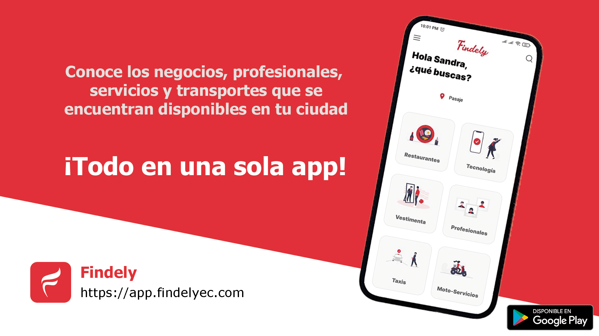
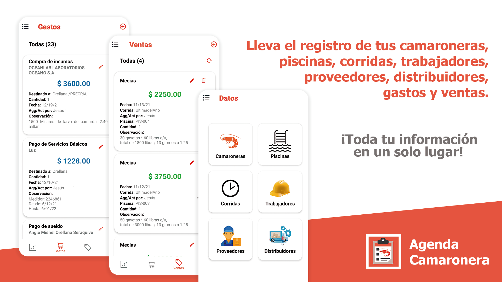
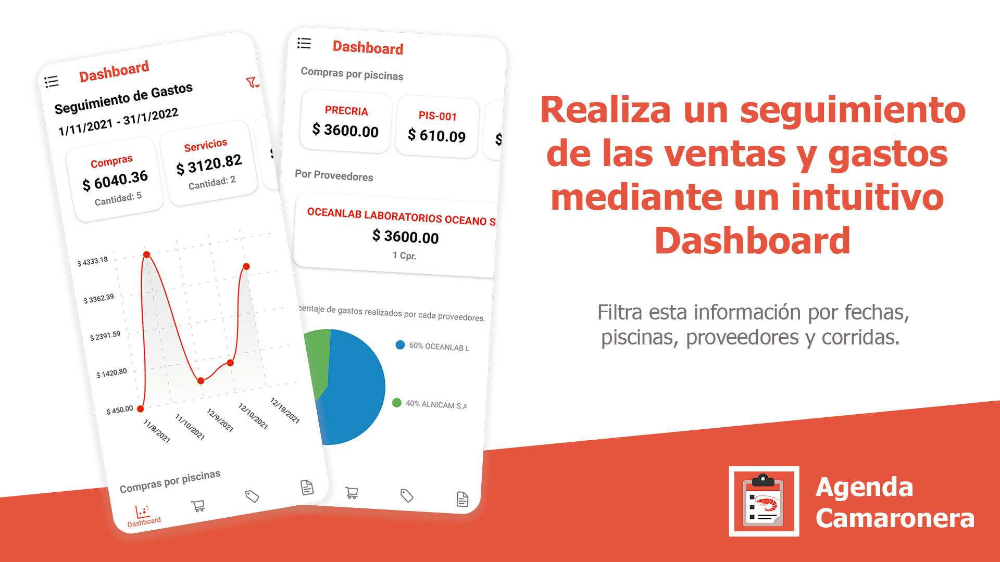
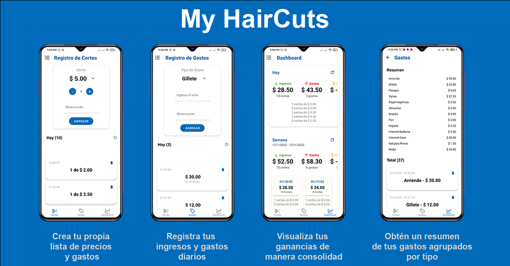

<h1 align="center">Hi there, I'm Alberto Torres </h1>

## ⚡ About me!

- 💻 Software Engineer
- 🧑‍🦰 I'm a person with a high spirit of improvement personally and professionally, always willing to acquire new knowledge that allows me to be more productive and perform my work efficiently. I believe that self-learning and teamwork are key factors for professional growth.
- 👨‍💻 I currently work as a freelancer. I am a web and mobile developer dedicated to creating software solutions using frameworks such as React.js, React Native, and Expo.
- 🤓 My main programming languages are JavaScript, TypeScript, and Node.js.
- 🔥 I have knowledge about the use of Backend as a Service platforms such as Firebase.
- 🍃 I have also worked with database systems such as Mongo Db, MySQL, PostgreSQL, and Firestore.

 

## ⚡ My social networks!

 

## Languages and Tools

 

    
    
    
    
    
    
    
    
    
    
    
    
    
    
    
    
    
    

  

## Github Stats

 

  
  
  

  

## **Latest Projects**

### **Findely** 

 

- Findely is a platform that aims to allow people to know important information about the various businesses, professionals, services, transportation and more that are available in their city, all in a single app.

- Within the Business Section people can find restaurants, coffee shops, liquor stores, clothing stores, technology stores and more. They also have access to the product catalogs of each business and can place orders directly from the app, where the order will arrive in a clear and orderly way to the business' WhatsApp.

- With the Professional Section, people will find qualified professionals such as Doctors, Lawyers, Accountants, Dentists, Veterinarians, etc. as well as unskilled professionals such as Masons, Carpenters, Electricians and more

- Learn more about this project here:

  -  <a href="https://findelyec.com/" target="_blank">👉 Findely Official Page</a>
  -  <a href="https://app.findelyec.com/" target="_blank">👉 Findely Web App</a>
  -  <a href="https://play.google.com/store/apps/details?id=com.findely.findely&hl=es&gl=US" target="_blank">👉 Findely Android App</a>

  
### **Agenda Camaronera** 
 

- Agenda Camaronera is an application that aims to facilitate the management of information within small shrimp companies, in addition to providing the indicators (KPIs) necessary to carry out efficient decision making.

- The application allows the segmentation of users, so the administrator can register other collaborators to perform certain tasks within the same application according to the assigned position (secretary, laborer or administrator).

- The user can manage the information of their shrimp farms, pools, runs, workers, suppliers and distributors in one place and consult them quickly.

- In addition, you can register your expenses and sales in a clear and orderly manner, with the possibility of attaching images of invoices or other documents corresponding to these operations.
  
- It also has an intuitive dashboard that presents various indicators based on the information collected. In this way the user can keep track of their expenses and sales, as well as apply a series of filters that will help you easily identify which of your pools generates higher profits, which are the months with higher sales and more relevant information that allows you to make better decisions for the benefit of your company.

- Learn more about this project here:

  -  <a href="https://app-klargo.web.app/" target="_blank">👉 Agenda Camaronera Web App</a>
  -  <a href="https://play.google.com/store/apps/details?id=com.findely.agendacamaronera" target="_blank">👉 Agenda Camaronera Android App</a>

  
### **MY Haircuts** 
 

- My Haircuts is an application that I developed some time ago for a group of barbers in my town, it aims to facilitate the registration of their cuts and expenses throughout the month, as they had told me that it is difficult to know their net profits because their income and expenses are generated daily, so I decided to help by creating a mobile solution using technologies such as React Native, Expo and Firebase.

- Learn more about this project here:

  -  <a href="https://play.google.com/store/apps/details?id=com.findely.myhaircuts" target="_blank">👉 My Haircuts Android App</a>